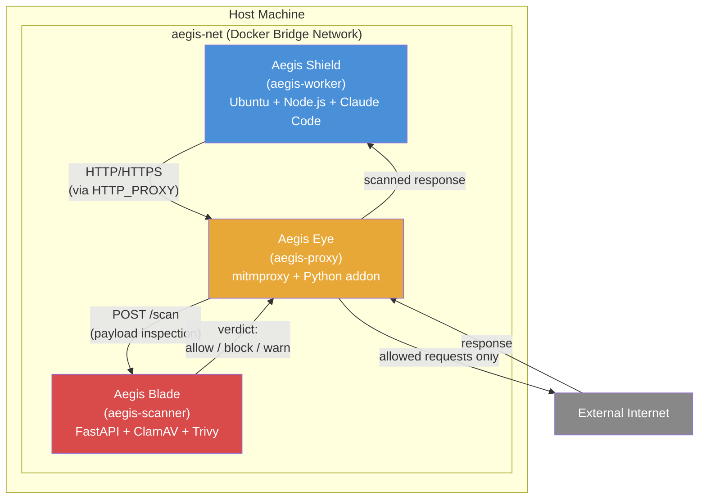
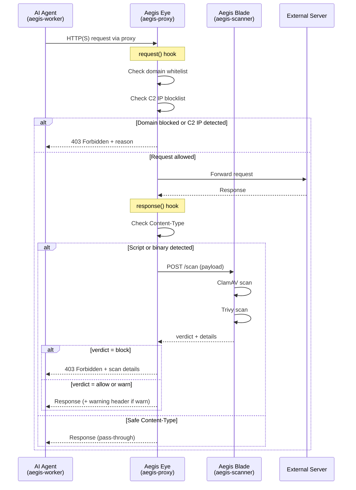
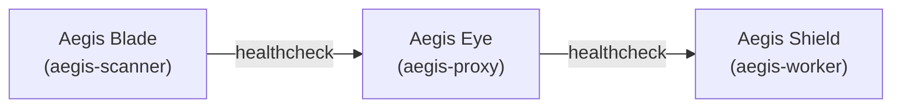

# Architecture

## System Overview

Aegis は Docker Compose で連携する 3 つのサービスから構成される。

| Service | Codename | Docker Service | Role |
|---|---|---|---|
| [Aegis Shield](components/worker.md) | Shield | `aegis-worker` | AI エージェントの隔離実行環境（プロセス隔離層） |
| [Aegis Eye](components/proxy.md) | Eye | `aegis-proxy` | HTTP/HTTPS インターセプトプロキシ（トラフィック検査層） |
| [Aegis Blade](components/scanner.md) | Blade | `aegis-scanner` | ClamAV + Trivy スキャンエンジン（深層スキャン層） |

## Request Lifecycle

AI エージェントが外部リクエストを発行してからレスポンスを受け取るまでの全フロー。

## Trust Boundaries

| Boundary | Inside | Outside | Protection |
|---|---|---|---|
| Container isolation | aegis-worker process | Host OS, other containers | Docker namespace/cgroup |
| Network restriction | aegis-net internal traffic | Direct internet access | Worker has no external network |
| Proxy gateway | Inspected/approved traffic | Raw external traffic | mitmproxy + scan rules |
| Scanner verdict | Scanned payloads | Unscanned payloads | ClamAV + Trivy |

## Network Topology

- **aegis-net**: 全コンテナが接続する内部 Docker ブリッジネットワーク
- **Worker**: `aegis-net` のみに接続。直接の外部アクセスなし
- **Proxy**: `aegis-net` + 外部ネットワークに接続。ゲートウェイとして機能
- **Scanner**: `aegis-net` のみに接続。外部アクセス不要（定義ファイル更新時のみ例外）

## Service Dependencies

起動順序: Blade (最初) → Eye (Blade の healthcheck 通過後) → Shield (Eye の healthcheck 通過後)
