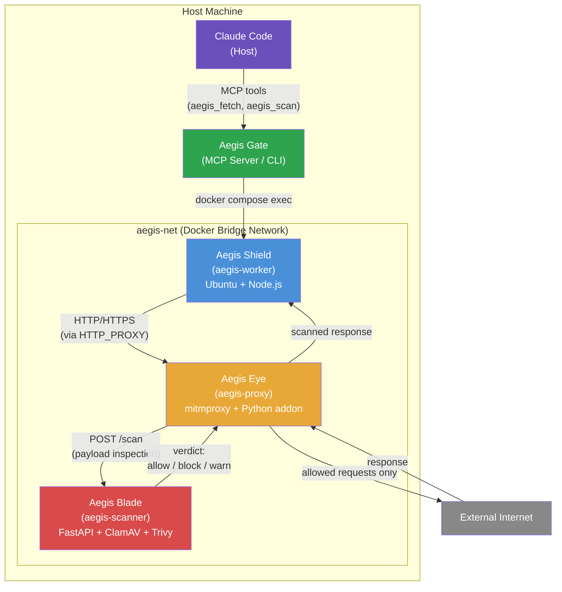
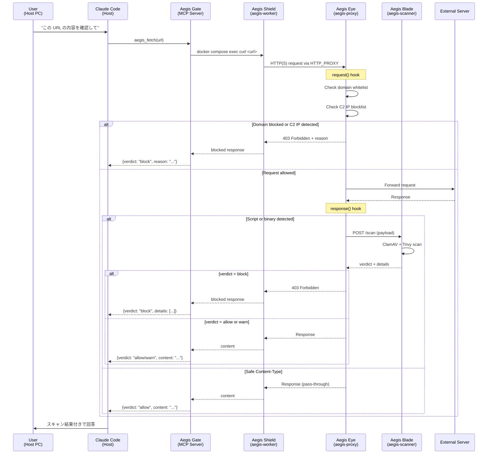
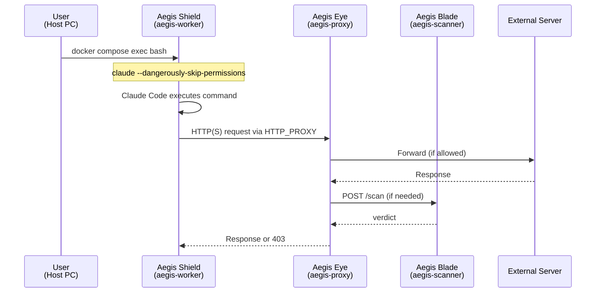
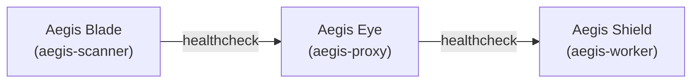

# Architecture

## System Overview

Aegis は Docker Compose で連携する 3 つのバックエンドサービスと、ホスト側の統合レイヤーから構成される。

| Service | Codename | Location | Role |
|---|---|---|---|
| [Aegis Gate](components/gate.md) | Gate | Host | MCP Server / CLI — Claude Code とバックエンドの統合レイヤー |
| [Aegis Shield](components/worker.md) | Shield | Docker (`aegis-worker`) | AI エージェントの隔離実行環境（プロセス隔離層） |
| [Aegis Eye](components/proxy.md) | Eye | Docker (`aegis-proxy`) | HTTP/HTTPS インターセプトプロキシ（トラフィック検査層） |
| [Aegis Blade](components/scanner.md) | Blade | Docker (`aegis-scanner`) | ClamAV + Trivy スキャンエンジン（深層スキャン層） |

## Request Lifecycle

ユーザーはホスト PC のコンソールで Claude Code を操作する。外部リソースへのアクセスが必要な場合、以下の利用パターンがある:

- **パターン A (MCP)**: Claude Code が Aegis Gate の MCP ツール（`aegis_fetch` 等）を呼び出す。最も推奨される方式
- **パターン B (CLI)**: ユーザーまたは Claude Code が `aegis` CLI コマンドを直接実行する
- **パターン C (Worker 内起動)**: aegis-worker 内で Claude Code を起動する（`claude --dangerously-skip-permissions`）

いずれの場合も、外部通信は全て Aegis Eye (proxy) → Aegis Blade (scanner) を経由する。

### Pattern A: MCP Server 経由（推奨）

### Pattern C: Worker 内で Claude Code を直接起動

## Trust Boundaries

| Boundary | Inside | Outside | Protection |
|---|---|---|---|
| Container isolation | aegis-worker process | Host OS, other containers | Docker namespace/cgroup |
| Network restriction | aegis-net internal traffic | Direct internet access | Worker has no external network |
| Proxy gateway | Inspected/approved traffic | Raw external traffic | mitmproxy + scan rules |
| Scanner verdict | Scanned payloads | Unscanned payloads | ClamAV + Trivy |

## Network Topology

- **aegis-net**: 全コンテナが接続する内部 Docker ブリッジネットワーク
- **Worker**: `aegis-net` のみに接続。直接の外部アクセスなし
- **Proxy**: `aegis-net` + 外部ネットワークに接続。ゲートウェイとして機能
- **Scanner**: `aegis-net` のみに接続。外部アクセス不要（定義ファイル更新時のみ例外）

## Service Dependencies

起動順序: Blade (最初) → Eye (Blade の healthcheck 通過後) → Shield (Eye の healthcheck 通過後)
