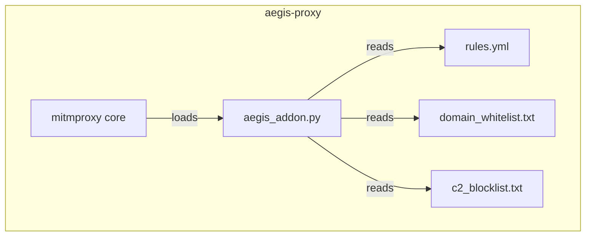

# Aegis Eye (Proxy)

mitmproxy ベースの HTTP/HTTPS インターセプトプロキシ。

## Overview

`aegis-proxy` は全ての Worker からの外部通信をインターセプトし、リアルタイムでセキュリティ検査を行う。危険なリクエストやレスポンスをブロックし、疑わしいペイロードを `aegis-scanner` に転送して深層スキャンを実施する。

## Base Image

| Item | Value |
|---|---|
| Base | Python 3.12 slim |
| Proxy | mitmproxy (latest) |
| Listen port | 8080 (HTTP proxy) |
| Web UI port | 8081 (mitmweb, optional) |

## Architecture



## Interception Flow

### request() Hook

リクエスト送信前に実行される同期チェック。

1. **Domain whitelist check**: バイナリダウンロード先のドメインがホワイトリストに含まれるか確認
2. **C2 IP blocklist check**: 接続先 IP が既知の C2 アドレスリストに含まれないか確認
3. **URL pattern check**: 危険な URL パターン（既知のマルウェア配布サイト等）をチェック

ブロック時は `403 Forbidden` レスポンスを返し、理由を JSON body で通知する。

### response() Hook

レスポンス受信後に実行される検査。

1. **Content-Type inspection**: レスポンスの Content-Type を確認
2. **Script pattern check**: テキストレスポンスに危険なパターン（`curl | bash` 等）が含まれないか検査
3. **Binary scan delegation**: バイナリ/実行ファイルの場合、`aegis-scanner` に非同期スキャンを委託

```python
# Pseudo-code for response hook
async def response(self, flow: http.HTTPFlow):
    content_type = flow.response.headers.get("content-type", "")

    # Script pattern check (inline)
    if is_script_content(content_type):
        if has_dangerous_patterns(flow.response.content):
            block_response(flow, reason="dangerous script pattern detected")
            return

    # Binary scan (delegate to scanner)
    if is_binary_content(content_type):
        verdict = await scan_payload(flow.response.content, flow.request.url)
        if verdict == "block":
            block_response(flow, reason="malware/vulnerability detected")
        elif verdict == "warn":
            add_warning_header(flow)
```

## TLS Interception

mitmproxy は HTTPS 通信をインターセプトするため、独自の CA 証明書を生成する。

- CA 証明書は初回起動時に自動生成
- 生成された証明書は Docker volume で永続化
- Worker コンテナに bind mount で共有

```yaml
volumes:
  - aegis-certs:/home/mitmproxy/.mitmproxy
```

## Logging

全てのリクエスト処理結果を構造化 JSON ログで出力する。

```json
{
  "timestamp": "2026-03-23T10:15:30Z",
  "request_id": "req_abc123",
  "action": "block",
  "reason": "dangerous_script_pattern",
  "method": "GET",
  "url": "https://example.com/install.sh",
  "content_type": "text/x-shellscript",
  "pattern_matched": "curl.*|.*bash",
  "source": "aegis-proxy"
}
```

## Failure Mode

**Fail-closed**: `aegis-scanner` への接続失敗時やタイムアウト時は、該当リクエストを**ブロック**する。安全側に倒すことで、スキャナー障害時にマルウェアが通過することを防ぐ。

## Dockerfile Outline

```dockerfile
FROM python:3.12-slim

RUN pip install mitmproxy

COPY aegis_addon.py /opt/aegis/
COPY rules/ /opt/aegis/rules/

EXPOSE 8080 8081

ENTRYPOINT ["mitmdump", "--script", "/opt/aegis/aegis_addon.py", "--listen-port", "8080"]
```
