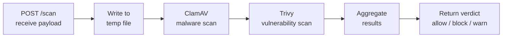

# Aegis Blade (Scanner)

ClamAV + Trivy を用いた非同期スキャンエンジン。

## Overview

`aegis-scanner` は `aegis-proxy` からペイロードを受け取り、マルウェアと脆弱性の深層スキャンを実行する REST API サービス。スキャン結果に基づいて allow / block / warn の判定を返す。

## Base Image

| Item | Value |
|---|---|
| Base | Python 3.12 slim |
| Framework | FastAPI + uvicorn |
| Scanner 1 | ClamAV (clamdscan + freshclam) |
| Scanner 2 | Trivy |
| Listen port | 8080 |

## Scan Pipeline



### Step 1: Receive Payload

`aegis-proxy` から multipart/form-data でペイロードを受信。

### Step 2: ClamAV Scan

ClamAV daemon (`clamd`) を使用してマルウェアシグネチャのマッチングを実行。

- ウイルス検出時: `block` 判定
- エラー時: `block` 判定（fail-closed）

### Step 3: Trivy Scan

Trivy を使用して既知の脆弱性（CVE）をスキャン。

- Critical/High severity 検出時: `block` 判定
- Medium severity 検出時: `warn` 判定
- Low/None: `allow` 判定

### Step 4: Verdict Aggregation

両スキャナーの結果を統合し、最も厳しい判定を採用する。

| ClamAV | Trivy | Final Verdict |
|---|---|---|
| clean | allow | **allow** |
| clean | warn | **warn** |
| clean | block | **block** |
| infected | any | **block** |
| error | any | **block** |

## REST API

### POST /scan

ペイロードをスキャンし、判定を返す。

**Request:**

```
POST /scan HTTP/1.1
Content-Type: multipart/form-data

- file: (binary payload)
- content_type: "application/x-executable"
- source_url: "https://example.com/binary"
- request_id: "req_abc123"
```

**Response (200 OK):**

```json
{
  "request_id": "req_abc123",
  "verdict": "block",
  "details": [
    {
      "scanner": "clamav",
      "result": "INFECTED",
      "threat": "Win.Trojan.Agent-123456"
    },
    {
      "scanner": "trivy",
      "result": "CRITICAL",
      "vulnerabilities": [
        {
          "id": "CVE-2024-12345",
          "severity": "CRITICAL",
          "description": "Remote code execution vulnerability"
        }
      ]
    }
  ],
  "scan_duration_ms": 1250
}
```

### GET /health

ヘルスチェックエンドポイント。

**Response (200 OK):**

```json
{
  "status": "healthy",
  "clamav": "ready",
  "trivy": "ready",
  "clamav_db_age_hours": 2,
  "trivy_db_age_hours": 18
}
```

## Definition Updates

### ClamAV Database

| タイミング | 方法 | 備考 |
|---|---|---|
| 初回起動 | `freshclam` で最新 DB をダウンロード | entrypoint.sh 内で実行 |
| 定期更新 | `freshclam` を 6 時間ごとに実行 | cron or バックグラウンドプロセス |
| 手動更新 | `aegis update` (Gate CLI 経由) | 即時反映 |

- `clamd` デーモンは DB ファイルの変更を検知し、**再起動なしで自動リロード**する
- DB は Docker volume (`clamav-db`) に永続化され、コンテナ再起動時にもダウンロード不要

```yaml
volumes:
  - clamav-db:/var/lib/clamav
```

### Trivy Database

| タイミング | 方法 | 備考 |
|---|---|---|
| 初回起動 | entrypoint.sh で `trivy --download-db-only` を実行 | 初回は 1-2 分かかる |
| 定期更新 | 日次で `trivy --download-db-only` を実行 | cron or バックグラウンドプロセス |
| 手動更新 | `aegis update` (Gate CLI 経由) | 即時反映 |
| スキャン時 | `--skip-db-update` を使用 | 定期更新に任せ、スキャン時のオーバーヘッドを回避 |

- Trivy DB は `/root/.cache/trivy/db` に保存
- Docker volume で永続化し、コンテナ再起動時の再ダウンロードを防止

```yaml
volumes:
  - trivy-db:/root/.cache/trivy
```

### Update API

Scanner に DB 更新をトリガーする API エンドポイントを提供する。Gate CLI の `aegis update` から呼び出される。

**POST /update**

```json
// Request
{"targets": ["clamav", "trivy"]}  // 省略時は全て更新

// Response (200 OK)
{
  "clamav": {"status": "updated", "previous_age_hours": 5, "duration_ms": 12000},
  "trivy": {"status": "updated", "previous_age_hours": 22, "duration_ms": 45000}
}
```

## Performance Configuration

| Parameter | Default | Description |
|---|---|---|
| `AEGIS_SCAN_TIMEOUT` | `30000` (ms) | スキャンタイムアウト |
| `AEGIS_MAX_FILE_SIZE` | `52428800` (50MB) | スキャン対象最大ファイルサイズ |
| `AEGIS_WORKERS` | `2` | uvicorn worker 数 |

タイムアウト超過時は `block` 判定（fail-closed）。

## Dockerfile Outline

```dockerfile
FROM python:3.12-slim

# ClamAV
RUN apt-get update && apt-get install -y \
    clamav clamav-daemon clamav-freshclam \
    && rm -rf /var/lib/apt/lists/*

# Trivy
RUN curl -sfL https://raw.githubusercontent.com/aquasecurity/trivy/main/contrib/install.sh | sh -s -- -b /usr/local/bin

# Python dependencies
RUN pip install fastapi uvicorn python-multipart

COPY scanner/ /opt/aegis/scanner/

# Initialize ClamAV DB
RUN freshclam

EXPOSE 8080

CMD ["uvicorn", "scanner.main:app", "--host", "0.0.0.0", "--port", "8080"]
```
