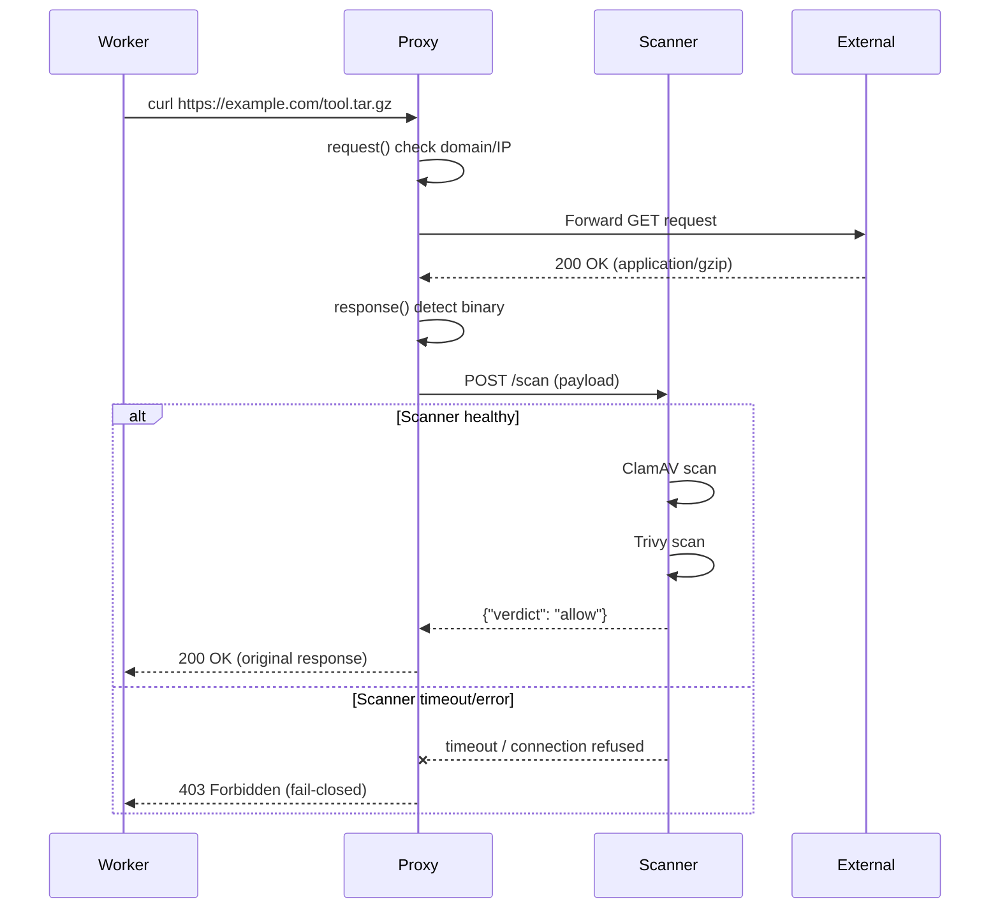

# Inter-Component API

コンポーネント間の通信仕様。

## Overview

Aegis 内部では `aegis-proxy` と `aegis-scanner` 間で REST API 通信を行う。通信は Docker 内部ネットワーク (`aegis-net`) 上で行われ、外部には公開されない。

## Proxy to Scanner Communication

### Protocol

- **Transport**: HTTP (内部ネットワークのため TLS 不要)
- **Base URL**: `http://aegis-scanner:8080`
- **Content-Type**: `multipart/form-data` (scan request), `application/json` (response)

### Scan Request

```
POST /scan HTTP/1.1
Host: aegis-scanner:8080
Content-Type: multipart/form-data; boundary=----AegisBoundary

------AegisBoundary
Content-Disposition: form-data; name="file"; filename="payload.bin"
Content-Type: application/octet-stream

<binary payload>
------AegisBoundary
Content-Disposition: form-data; name="content_type"

application/x-executable
------AegisBoundary
Content-Disposition: form-data; name="source_url"

https://example.com/download/binary
------AegisBoundary
Content-Disposition: form-data; name="request_id"

req_abc123
------AegisBoundary--
```

| Field | Type | Required | Description |
|---|---|---|---|
| `file` | binary | Yes | スキャン対象のペイロード |
| `content_type` | string | Yes | 元レスポンスの Content-Type |
| `source_url` | string | Yes | ダウンロード元 URL |
| `request_id` | string | Yes | トレーシング用リクエスト ID |

### Scan Response

```json
{
  "request_id": "req_abc123",
  "verdict": "block",
  "details": [
    {
      "scanner": "clamav",
      "result": "INFECTED",
      "threat": "Win.Trojan.Agent-123456"
    },
    {
      "scanner": "trivy",
      "result": "CRITICAL",
      "vulnerabilities": [
        {
          "id": "CVE-2024-12345",
          "severity": "CRITICAL",
          "description": "Remote code execution vulnerability"
        }
      ]
    }
  ],
  "scan_duration_ms": 1250
}
```

| Field | Type | Description |
|---|---|---|
| `request_id` | string | リクエスト ID（トレーシング用） |
| `verdict` | string | `allow`, `block`, `warn` のいずれか |
| `details` | array | 各スキャナーの結果詳細 |
| `scan_duration_ms` | integer | スキャン所要時間 (ms) |

### Verdict Values

| Verdict | Meaning | Proxy Action |
|---|---|---|
| `allow` | 脅威なし | レスポンスをそのまま Worker に転送 |
| `warn` | 低〜中リスクの検出 | レスポンスを転送し、`X-Aegis-Warning` ヘッダーを追加 |
| `block` | 高リスクの脅威検出 | 403 Forbidden を Worker に返却 |

## Health Check

### GET /health

```json
{
  "status": "healthy",
  "clamav": "ready",
  "trivy": "ready",
  "clamav_db_age_hours": 2
}
```

Docker Compose の `healthcheck` で使用:

```yaml
healthcheck:
  test: ["CMD", "curl", "-f", "http://localhost:8080/health"]
  interval: 30s
  timeout: 10s
  retries: 3
  start_period: 60s
```

## Error Handling

### Timeout

- Default: 30 秒
- Scanner がタイムアウトした場合、Proxy は `block` 判定として処理（fail-closed）

### Connection Failure

- Scanner への接続に失敗した場合、Proxy は `block` 判定として処理
- ログに接続エラーを記録

### Response Format Error

- Scanner から不正なレスポンスを受信した場合、`block` 判定として処理
- ログにパースエラーを記録

## Request Lifecycle (Sequence Diagram)



## Proxy Warning Header

`warn` 判定時に Proxy が追加するヘッダー:

```
X-Aegis-Warning: medium-risk vulnerability detected; see scan details
X-Aegis-Request-Id: req_abc123
```
