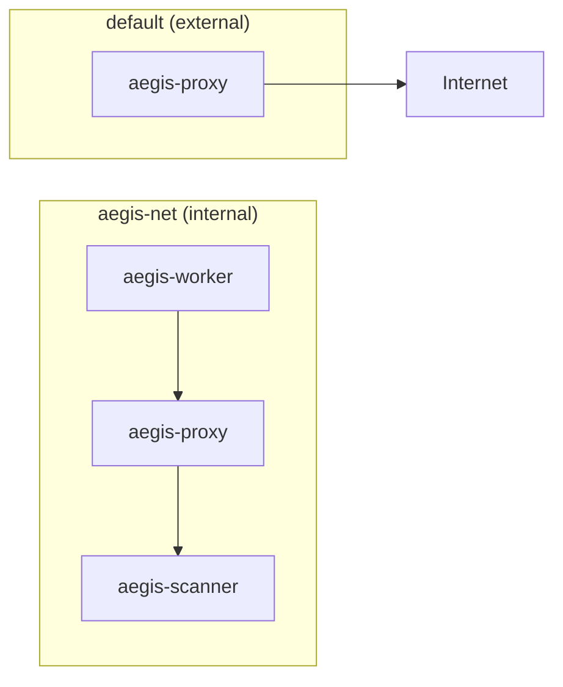

# Docker Compose Configuration

Aegis の全サービスを Docker Compose で構成する。

## docker-compose.yml

```yaml
services:
  # ============================================================
  # Aegis Blade (Scanner) - starts first
  # ============================================================
  aegis-scanner:
    build:
      context: .
      dockerfile: scanner/Dockerfile
    container_name: aegis-scanner
    networks:
      - aegis-net
    volumes:
      - clamav-db:/var/lib/clamav
      - trivy-db:/root/.cache/trivy
    environment:
      AEGIS_SCAN_TIMEOUT: "30000"
      AEGIS_MAX_FILE_SIZE: "52428800"
      AEGIS_WORKERS: "2"
    deploy:
      resources:
        limits:
          memory: 2G
          cpus: "1.0"
    healthcheck:
      test: ["CMD", "curl", "-f", "http://localhost:8080/health"]
      interval: 30s
      timeout: 10s
      retries: 3
      start_period: 60s
    restart: unless-stopped

  # ============================================================
  # Aegis Eye (Proxy) - starts after scanner is healthy
  # ============================================================
  aegis-proxy:
    build:
      context: .
      dockerfile: proxy/Dockerfile
    container_name: aegis-proxy
    depends_on:
      aegis-scanner:
        condition: service_healthy
    networks:
      - aegis-net
      - default  # external network access
    ports:
      - "8081:8081"  # mitmweb UI (optional, development only)
    volumes:
      - aegis-certs:/home/mitmproxy/.mitmproxy
      - ./rules:/opt/aegis/rules:ro
    environment:
      AEGIS_SCANNER_URL: "http://aegis-scanner:8080"
      AEGIS_RULES_PATH: "/opt/aegis/rules"
      AEGIS_LOG_LEVEL: "INFO"
      AEGIS_FAIL_MODE: "closed"
    healthcheck:
      test: ["CMD", "curl", "-f", "-x", "http://localhost:8080", "http://example.com"]
      interval: 30s
      timeout: 10s
      retries: 3
      start_period: 10s
    restart: unless-stopped

  # ============================================================
  # Aegis Shield (Worker) - starts after proxy is healthy
  # ============================================================
  aegis-worker:
    build:
      context: .
      dockerfile: worker/Dockerfile
    container_name: aegis-worker
    depends_on:
      aegis-proxy:
        condition: service_healthy
    networks:
      - aegis-net
    volumes:
      - ${AEGIS_WORKSPACE:-./workspace}:/workspace
      - aegis-certs:/certs:ro
    environment:
      HTTP_PROXY: "http://aegis-proxy:8080"
      HTTPS_PROXY: "http://aegis-proxy:8080"
      NO_PROXY: "aegis-scanner,localhost,127.0.0.1"
      NODE_EXTRA_CA_CERTS: "/certs/mitmproxy-ca-cert.pem"
    security_opt:
      - no-new-privileges:true
    cap_drop:
      - ALL
    cap_add:
      - NET_RAW
    deploy:
      resources:
        limits:
          memory: 4G
          cpus: "2.0"
    stdin_open: true
    tty: true
    restart: unless-stopped

# ============================================================
# Networks
# ============================================================
networks:
  aegis-net:
    driver: bridge
    internal: true  # no external access from this network
  default:
    driver: bridge   # external access (proxy only)

# ============================================================
# Volumes
# ============================================================
volumes:
  clamav-db:
    driver: local
  trivy-db:
    driver: local
  aegis-certs:
    driver: local
```

## Network Design

### aegis-net (internal)

全 3 サービスが接続する内部ネットワーク。`internal: true` により、このネットワークからの直接外部アクセスは不可。

### default (external)

`aegis-proxy` のみが接続する外部ネットワーク。プロキシがゲートウェイとして外部通信を仲介する。



!!! note
    `aegis-worker` と `aegis-scanner` は `aegis-net` のみに接続されるため、直接インターネットにアクセスすることはできない。

## Startup Order

1. **aegis-scanner**: ClamAV DB ロード + Trivy 初期化 → healthcheck 通過（約 60 秒）
2. **aegis-proxy**: mitmproxy 起動 + scanner 接続確認 → healthcheck 通過（約 10 秒）
3. **aegis-worker**: プロキシ経由の通信が可能な状態で起動

## Volume Details

| Volume | Mount Point | Purpose |
|---|---|---|
| `clamav-db` | `/var/lib/clamav` (scanner) | ClamAV 定義ファイルの永続化 |
| `trivy-db` | `/root/.cache/trivy` (scanner) | Trivy 脆弱性 DB の永続化 |
| `aegis-certs` | `/home/mitmproxy/.mitmproxy` (proxy), `/certs` (worker) | mitmproxy CA 証明書の共有 |
| `${AEGIS_WORKSPACE:-./workspace}` | `/workspace` (worker) | プロジェクトディレクトリのマウント（環境変数で変更可能） |
| `./rules` | `/opt/aegis/rules` (proxy) | スキャンルール設定ファイル |

## Workspace Configuration

Worker コンテナの `/workspace` にマウントされるホスト側ディレクトリは `AEGIS_WORKSPACE` 環境変数で変更できる。

```bash
# デフォルト: ./workspace ディレクトリ
docker compose up -d

# 任意のプロジェクトディレクトリを指定
AEGIS_WORKSPACE=~/Projects/my-app docker compose up -d

# .env ファイルで永続的に設定
echo "AEGIS_WORKSPACE=~/Projects/my-app" >> .env
docker compose up -d
```

## Operations

```bash
# Start all services
docker compose up -d

# Enter worker container
docker compose exec aegis-worker /bin/bash

# View proxy logs
docker compose logs -f aegis-proxy

# View scanner logs
docker compose logs -f aegis-scanner

# Restart proxy (e.g., after rule changes)
docker compose restart aegis-proxy

# Stop all services
docker compose down

# Stop and remove volumes (full cleanup)
docker compose down -v
```
